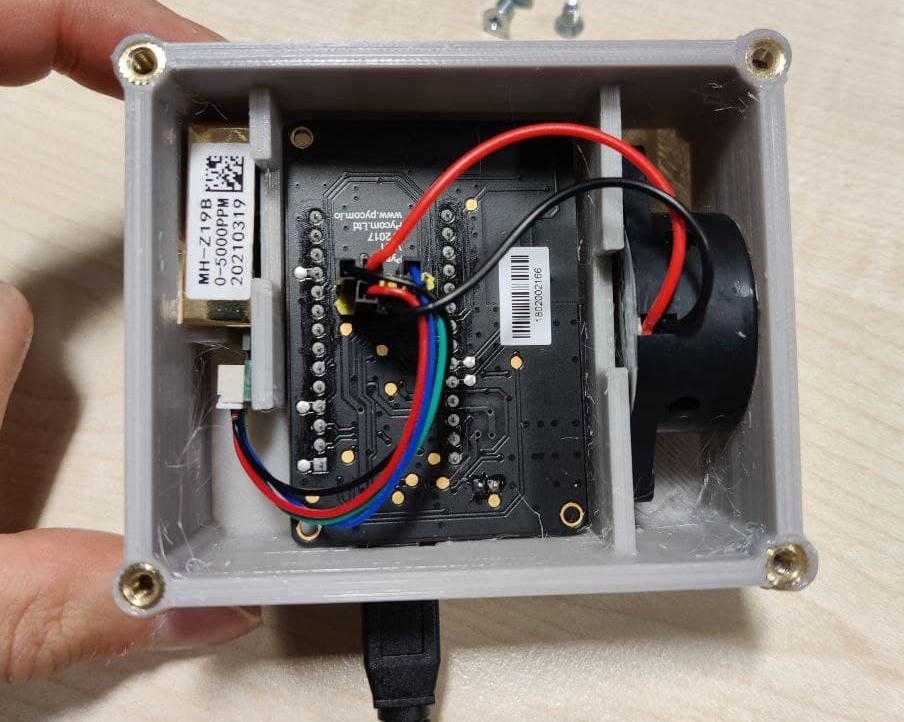
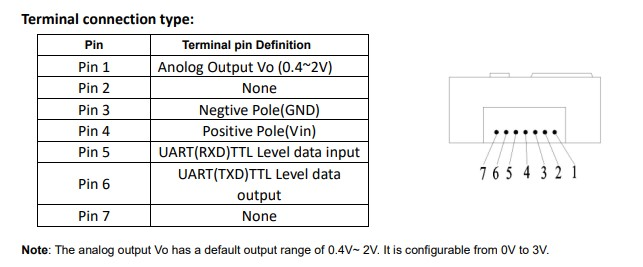
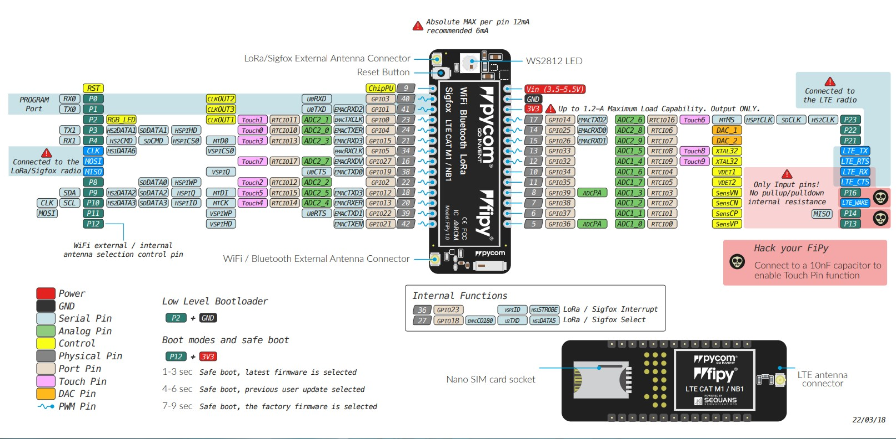
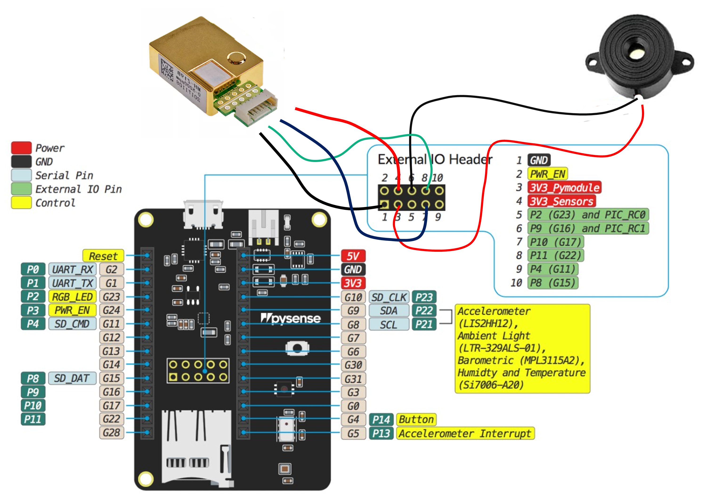

AUTHOR: DAVID TENA GAGO

# CO2 sensor for the office

This repository contains the code (micropython) the FiPy firmware and the designs of the 3d printed case for the development of an indoors IoT-based CO2 concentration monitoring tool.   

the code than should be flashed into the fipy (or any other ESP32 dev board), is the content of the directory ``src/``. The rest should not be uploaded.

## Usage (version 1.0):

### Opearation mode
Turn the device on by plugging it. By default, the sensor will start measuring in the normal operation mode after 2 beeps to indicate the start up. After the noise signal, a blue heartbeat will come from the FiPy LED. When a higher CO2 concentration is reached (800 by default),
the LED will turn red constantly, and a one beep will sound. When the concentration is lower than the threshold again, the sensor will come back to the blue heartbeat.

Normally, after the initial start up, a constant orange LED will indicate that there are lecture errors. It should change after a few seconds.

### Calibration
To calibrate the sensor you have to press once the PySense button (reachable through the front hole stripes). If pressed, the default calibration mode (zero level) will start. This will be indicated by a constant green light and 3 beeps. Ideally, the CO2 sensor should be placed somewhere with a 400 PPM concentration - outside or close to the window -. The calibration will finish when another beep indicates it, and will come back to the normal operation mode.

Another calibration method can be selected, which will consider the assumed CO2 concentration present in the environment where the sensor is being calibrated.

Also, the detection range can be selected. By default, the detection range is from 0 to 5000 PPM.

## Programming the FiPy
### UART
By default, the modules run an interactive python REPL on UART0 which is connected to P0 (RX) and P1 (TX) running at 115200 baud. The easiest way to connect to the FiPy is via our expansion board, but any USB UART adapter will suffice. Code can be run via this interactive REPL or you can use our PyMakr plugin for Atom or Visual Studio Code to upload code to the board.

### WiFi
By default, the FiPy also acts as a Wi–Fi access point SSID: fipy–wlan–XXXX with the password: www.pycom.io
Once connected to the FiPy’s Wi–Fi network you can access it in two ways:

#### Telnet
Running on port 23 is a telnet server. This acts in a very similar way to the UART. It presents you with an interactive REPL and can also be used to upload code via PyMakr

#### FTP
The FiPy also runs an FTP server that allows you to copy files to and from the device, include an SD card if one is connected. To connect to this FTP server, you need to use plain FTP (un–encrypted) with the following credentials:
* User: micro
* Password: python

## Boot modes
If powering up normally or upon pressing the reset button, a Pycom module will boot into standard mode; the boot.py file will be executed first, followed by main.py. It is possible to alter the boot procedure of the module by tying certain pins high or low when the module boots.
### Bootloader mode
In order to update the firmware of the FiPy device, it needs to be placed into bootloader mode. In order to do this, P2 (user button placed in the board that is connected to the FiPy) needs to be connected to ground when the device reboots. Once in bootloader mode you can use the Pycom firmware update tool to update to the latest official firmware. If you are developing your own firmware based on our open–source firmware, a flashing script is provided with the source code. This is not required if you are updating your MicroPython code.

### Safe boot mode
Sometimes the code you have written will prevent you gaining access to the REPL or prevent you updating your code. The micropython firmware features a safe boot feature that skips the boot.py and main.py scripts and goes straight to the REPL. To access this mode, you need to
connect P12 to 3.3V and reset the device. Upon entering safe boot mode, the on–board LED will begin to blink orange. Depending on the duration the pin is held at 3.3V, a different firmware will be run.
* 1 to 3 seconds: Current firmware without running boot.py or main.py
* 4 to 6 seconds: Previous firmware if the firmware was uploaded via OTA (without running boot.py and main.py)
* 7 to 9 seconds: Factory firmware is selected. 

## Hardware breakdown:
- Fipy: version 1.0
- Pysense (not version 2.0 X)
- CO2 sensor: MH-Z19B
- Buzzer: [SFM-27 DC 3-24V](https://www.amazon.co.uk/Electronic-Buzzer-Sounder-Continuous-Decibel/dp/B08TTFP58F/ref=dp_prsubs_1?pd_rd_i=B08TTFP58F&psc=1)

## Connections pinout
Acocording to FiPy documentation, the "user button" located in the PySense board is used to put the device in DFU-bootloader mode for firmware updates.

### MH-Z19B pinout

### Fipy pinout

### Connection diagram

